# AWS 巡检、事件驱动、灰度发布与 AI Ops Agent 需求

> 文档版本：v1  
> 日期：2026-07-21  
> 适用项目：`github-repositories-fllow`

## 1. 背景

当前生产链路为：Cloudflare Pages → API Gateway → Hono Lambda 薄代理 → Cloud Map → ECS Fargate Go API → Aurora PostgreSQL。系统已具备 GitHub 账户/仓库同步、统计页面、SAM/CloudFormation 部署和 GitHub Actions OIDC，但缺少主动巡检、异步事件处理、渐进式发布和智能运维闭环。

本次建设目标是把现有项目扩展为一套可演示、可告警、可回滚、可诊断的 AWS 生产运维样例，而不是分别创建互不相关的 AWS 服务 demo。

## 2. 建设范围

### 2.1 必做范围

1. CloudWatch Synthetics 主动巡检完整 API 链路。
2. 基于 GitHub 用户同步结果构建 SNS → SQS → Consumer → DLQ 的事件链路。
3. 使用 Lambda Alias、CodeDeploy 和 CloudWatch Alarm 完成 API Canary 灰度发布与自动回滚。
4. 在 AWS 上开发 AI Ops Agent，能够收集证据、解释事故、提出恢复建议，并在人审后执行有限的恢复动作。

### 2.2 选做范围

开发本地 MCP Server，将 AWS 只读运维能力暴露给支持 MCP 的 Agent；写操作必须走审批，不向本地 Agent 提供宽泛 AWS 权限。

### 2.3 不在本期范围

- ECS Go 服务蓝绿/Canary 发布；本期灰度对象仅为 API Gateway 后的 Hono Lambda。
- GitHub Token 异步入队或持久化。
- Agent 自主删除 CloudFormation 栈、队列、数据库或修改 IAM。
- 无人工确认的自动 DLQ 重放、生产回滚或扩缩容。

## 3. 总体架构

```mermaid
flowchart LR
    User["用户 / Cloudflare Pages"] --> APIGW["API Gateway"]
    Synthetic["CloudWatch Synthetics"] --> APIGW
    APIGW --> Alias["Lambda Alias: live"]
    Alias -->|90%| Current["当前版本"]
    Alias -->|10%| Candidate["候选版本"]
    Current --> ECS["ECS Go API"]
    Candidate --> ECS
    ECS --> DB[("Aurora")]

    ECS -->|GitHubUserSynced，不含 Token| Topic["SNS Topic"]
    Topic --> Queue["SQS Queue"]
    Queue --> Consumer["Consumer Lambda"]
    Queue -->|超过最大接收次数| DLQ["SQS DLQ"]

    Synthetic --> Alarm["CloudWatch Alarms"]
    Alias --> Alarm
    Consumer --> Alarm
    DLQ --> Alarm
    Alarm --> Alert["SNS 运维通知"]
    Alarm --> EB["EventBridge"]
    EB --> Orchestrator["AI Ops Orchestrator"]
    Orchestrator --> Agent["Amazon Bedrock Agent"]
    Agent --> Tools["Ops Action Lambda"]
    Tools --> Telemetry["Metrics / Logs / Deployments / DLQ"]
```



## 4. 业务场景

### 4.1 主动巡检

巡检每分钟执行两个步骤：

1. `GET /health`：验证 API Gateway → Lambda 的浅层可用性。
2. `GET /api/stats`：从 Secrets Manager 获取 Basic Auth，验证 Lambda → ECS → Aurora 的完整只读链路。

巡检必须校验 HTTP 状态、JSON 结构和耗时，产物写入专用 S3 Bucket。连续失败触发 CloudWatch Alarm 和 SNS 告警。仅检查 `/health` 不视为完成，因为它不能发现 ECS、Cloud Map 或数据库故障。

### 4.2 SNS/SQS 与死信队列

Go API 完成账户与仓库事务后，向 SNS 发布 `GitHubUserSynced` 事件。事件只包含业务标识和统计信息，不包含 GitHub Token、Basic Auth 或数据库凭据。

推荐事件契约：

```json
{
  "eventVersion": "1",
  "eventType": "GitHubUserSynced",
  "eventId": "uuid",
  "occurredAt": "2026-07-21T12:00:00Z",
  "correlationId": "uuid",
  "userId": 123,
  "githubId": 456,
  "username": "example",
  "reposCount": 42,
  "created": false
}
```

SNS 将事件投递到 SQS，Consumer Lambda 负责审计日志和自定义指标。Consumer 必须按 `eventId` 幂等处理并支持 Lambda SQS partial batch response。消息处理超过 3 次仍失败时进入 DLQ；主队列保留 4 天，DLQ 保留 14 天。

测试环境支持显式故障事件，验证重试、DLQ 告警和 redrive。生产业务接口不得提供任意用户可触发的故障开关。

### 4.3 API Canary 灰度上线

Hono Lambda 使用 `AutoPublishAlias: live` 和 SAM `DeploymentPreference`。默认策略为 `Canary10Percent10Minutes`：先将 10% 流量切到候选版本，观察 10 分钟，通过后切到 100%。

部署包含：

- PreTraffic Hook：直接验证候选版本的基础响应。
- Lambda Alias 错误率告警。
- API Gateway 5xx 告警。
- Synthetics 完整链路告警。
- 任一关键告警触发 CodeDeploy 自动回滚。
- PostTraffic Hook：100% 切流后的最终验证。

Synthetics 的 1 分钟频率应覆盖 10 分钟观察窗。ECS Go 服务继续使用现有 rolling deployment，后续需要时再单独设计 ECS 蓝绿发布。

### 4.4 AWS AI Ops Agent

Agent 以 CloudWatch Alarm 为事故入口，通过 EventBridge 启动 Orchestrator，收集告警、指标、日志、巡检结果、DLQ 和最近部署记录，再调用 Amazon Bedrock Agent 形成根因假设、影响说明和建议动作。

首版工具集：

| 工具 | 权限 | 说明 |
| --- | --- | --- |
| `get_system_health` | 只读 | 汇总 Lambda、ECS、Aurora、SQS、Canary 状态 |
| `get_active_alarms` | 只读 | 查询项目范围内活跃告警 |
| `query_service_logs` | 只读 | 查询 allowlist 日志组和受限时间范围 |
| `inspect_dlq` | 只读 | 返回数量与脱敏后的消息摘要 |
| `get_recent_deployments` | 只读 | 查询最近 CodeDeploy/CloudFormation 变更 |
| `request_dlq_redrive` | 需审批 | 创建 DLQ 重放申请 |
| `request_rollback` | 需审批 | 创建回滚申请 |
| `execute_approved_action` | 需审批 | 执行未过期且在 allowlist 内的动作 |

事故记录保存在 DynamoDB，至少包含 Incident ID、告警来源、证据、Agent 结论、建议动作、审批状态、执行结果和时间线。Agent 不直接获得破坏性权限；恢复动作由独立执行角色完成并保留 CloudTrail/CloudWatch 审计记录。

### 4.5 本地 MCP Server（选做）

`apps/aiops-mcp` 使用 TypeScript MCP SDK 和 AWS SDK v3，通过 stdio 暴露与云端 Agent 一致的只读工具。AWS 凭据来自 SSO/Profile 临时会话，禁止保存 Access Key。写操作只创建云端审批请求，不能直接执行生产变更。

## 5. 安全与合规约束

- GitHub Token 保持一次性透传，永不进入 SNS、SQS、日志或事故记录。
- Basic Auth 由 Secrets Manager 提供，Canary 日志不得输出凭据或 Authorization 头。
- 所有新增 Lambda 角色必须挂对应权限边界；先更新 bootstrap 栈，再部署业务栈。
- IAM 按区域、栈名前缀、日志组、队列和目标服务收窄。
- DLQ 消息展示必须脱敏并限制最大条数、最大字节数和可见性超时。
- Agent 工具不得接受任意 ARN、任意 Logs Insights 查询或任意 AWS API 名称。
- 写操作必须有 Incident ID、人工审批、有效期、幂等键和审计日志。
- RDS/EC2 的 `Description`/`GroupDescription` 继续只使用英文 ASCII。

## 6. 基础设施与部署边界

建议按职责拆栈：

- `template.yaml`：现有网络、Aurora、Hono Lambda，并加入 Alias/CodeDeploy 灰度资源。
- `infra/messaging.yaml`：SNS、SQS、DLQ、Consumer。
- `infra/observability.yaml`：Synthetics、S3、Alarm、Dashboard、告警 Topic。
- `infra/aiops.yaml`：Bedrock Agent、Action Lambda、Orchestrator、Incident 表和 EventBridge。
- `infra/github-oidc.yaml`：扩展部署权限和各类执行角色权限边界。

部署顺序：bootstrap → 主栈 → ECS → messaging → observability → aiops。删除顺序反向执行，避免跨栈引用阻塞。

## 7. 验收演练

1. 部署一个带可控 5xx 的候选 Lambda 版本。
2. CodeDeploy 切入 10% 流量，Synthetics 在观察窗内发现完整链路失败。
3. CloudWatch Alarm 触发，CodeDeploy 自动回滚到稳定版本。
4. AI Ops Agent 关联巡检、Lambda 日志和部署记录，生成事故结论。
5. 发布一条测试故障事件，Consumer 连续失败后消息进入 DLQ。
6. DLQ 告警触发，Agent 给出失败摘要和重放建议。
7. 人工批准 redrive，消息重新投递并成功消费。
8. Incident 记录完整时间线、审批人、动作和执行结果。

## 8. PRD 拆分

| 序号 | Feature | 说明 | 依赖 |
| --- | --- | --- | --- |
| 9 | observability-synthetics | 巡检、告警、Dashboard、通知 | 3、4、当前 ECS 架构 |
| 10 | event-driven-sns-sqs | 领域事件、SNS/SQS、Consumer、DLQ/redrive | 4、6、7 |
| 11 | api-canary-release | Lambda Alias、CodeDeploy、Hook、自动回滚 | 4、9 |
| 12 | aiops-agent | Bedrock Agent、事故编排、审批恢复 | 9、10、11 |
| 13 | local-aiops-mcp | 本地 MCP Server | 12（复用工具契约，选做） |

