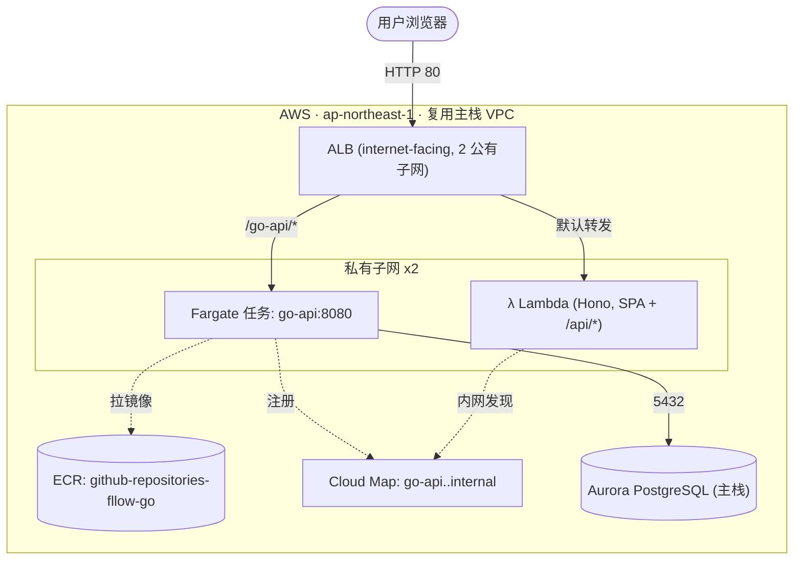
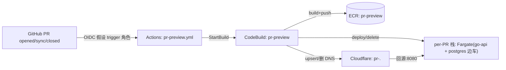

# 作业二实现说明 —— Go 服务上 ECS + 基于 PR 的独立预览环境

> **⚠️ 架构已更新（对齐架构图，见分支 `feat/align-dataflow-go-lambda-proxy`）：**
> 生产数据流已改为 **Web(Cloudflare Pages/Next.js) → API Gateway → Lambda 薄代理(不连库) → Cloud Map → Go(ECS，唯一连库) → Aurora**，bio 由 Lambda 调 **OpenRouter** 生成。
> 因此下文任务 2 里「ALB 作为公网入口 / 把 Lambda 挂进 ALB 目标组」已**作废**：**ALB 改为 `Scheme:internal` 仅测试**，生产入口是 API Gateway；Lambda 经 Cloud Map 内网直连 Go。ECR/ECS/Fargate/Cloud Map 仍如下文。任务 3(PR 预览)不变。最新接口/职责以 `.claude/CLAUDE.md` 与 `apps/go-api/README.md` 为准。

> 在原有 Hono+Lambda 作业之上，新增三件事：
> 1. Go 版账户服务（连库 + 迁移一部分 Node 代码 + 生成个人介绍）——见根 README 与 `apps/go-api`。
> 2. 用 **ECR + ECS + ALB + Fargate + Cloud Map** 把 Go 服务上云，并把既有 **Lambda 接口挂进同一个 ALB**。
> 3. 用 **Cloudflare + CodeBuild + 三个 IAM 角色**，为每个 PR 拉起一个独立的 Go 预览环境。

区域固定 `ap-northeast-1`，沿用主栈（`template.yaml`）的 VPC/子网/Aurora，不重复建网络与库。

## 任务 2：Go 服务上 ECS Fargate（`infra/ecs-fargate.yaml`）



**要点**
- **ECR**：`${stack}-go-api` 仓库，`ScanOnPush` + 生命周期（untagged 1 天过期、只留 10 个）；`EmptyOnDelete` 拆栈即清。
- **ECS/Fargate**：arm64、256 CPU/512MB，跑在 2 个私有子网，经主栈 NAT 出网拉镜像/调 GitHub；不分配公网 IP。DB 密码用 `resolve` 组装成 `DATABASE_URL`，Basic Auth 密码用 ECS `secrets`（不落任务定义明文）从主栈 `AuthSecret` 注入。
- **ALB**：唯一公网入口。默认动作转发到 **Hono Lambda 目标组**（`TargetType: lambda`，SPA + `/api/*`）——这就是「用 ALB 链接 lambda 接口」；`/go-api/*` 规则转发到 **Go 服务目标组**（IP 目标，健康检查 `/health`）。Go 容器用 `http.StripPrefix("/go-api")` 复用同一套 `/api`、`/health` 路由，与本地 Vite 代理语义一致。
- **Cloud Map**：私有 DNS 命名空间 `<stack>.internal`，ECS 服务自动注册 `go-api.<stack>.internal`（A 记录）。同 VPC 的 Hono Lambda 可据此内网直连 Go 服务、反之亦然 —— 服务间发现的内部链路。
- **安全组**：ALB SG 放行 80；ECS SG 只放行来自 ALB 的 8080；额外给主栈 DB SG 加一条「来自 ECS SG 的 5432」入站，让 Fargate 能连 Aurora（原本只放行 Lambda SG）。
- **IAM**：ECS 执行角色/任务角色都挂 `${stack}-ecs-boundary` 权限边界（由 `infra/github-oidc.yaml` 的 admin 持有），与主栈 Lambda 防提权模型一致。

**部署（首次镜像与服务的先有鸡问题）**
```bash
# 0) 先在 bootstrap 栈补上 ECS 权限边界（github-oidc.yaml 已更新，重跑一次）
aws cloudformation deploy --region ap-northeast-1 --stack-name github-oidc-deployer \
  --capabilities CAPABILITY_NAMED_IAM --template-file infra/github-oidc.yaml \
  --parameter-overrides GitHubOrg=<你的用户名> GitHubRepo=github-repositories-fllow

# 1) 先建栈但服务规模 0（此时 ECR 还没镜像，避免服务无法稳定回滚）
sam deploy --template-file infra/ecs-fargate.yaml --stack-name github-repositories-fllow-ecs \
  --capabilities CAPABILITY_NAMED_IAM --resolve-s3 \
  --parameter-overrides DesiredCount=0

# 2) 构建 arm64 镜像并推到 ECR（仓库 URI 见栈输出 EcrRepositoryUri）
pnpm build:go-image     # 或 docker build --platform linux/arm64 -t <uri>:<sha> apps/go-api
docker push <EcrRepositoryUri>:<sha>

# 3) 拉起服务
sam deploy --template-file infra/ecs-fargate.yaml --stack-name github-repositories-fllow-ecs \
  --capabilities CAPABILITY_NAMED_IAM --resolve-s3 \
  --parameter-overrides DesiredCount=1 ImageTag=<sha>

# 访问：栈输出 AlbUrl（默认→Hono，/go-api/profile/<user>→Go）
```

## 任务 3：基于 PR 的独立预览环境（Cloudflare + CodeBuild + 三个 IAM 角色）



**三个 IAM 角色（`infra/pr-preview.yaml`，admin 一次性建栈，仓库零长期密钥）**
1. **Trigger 角色** —— GitHub OIDC 信任本仓库 `pull_request`，只允许 `codebuild:StartBuild` 本项目，最小面。
2. **CodeBuild 构建/部署角色** —— 构建镜像、部署/删除 `${stack}-pr-*` 的 per-PR 栈、读 Cloudflare 密钥、`PassRole` 仅限把运行角色交给 ECS 任务。
3. **预览运行角色** —— 每个 PR 的 Fargate 任务用作执行/任务角色（拉镜像 + 写日志）。

**独立环境（`infra/pr-preview-env.yaml`）**：一个 Fargate 任务里跑 `go-api` + 一次性 `postgres:16-alpine` 边车（`DATABASE_URL=…@localhost:5432`），随任务生死、PR 之间彼此隔离、**绝不碰生产库**。公有子网 + 公网 IP，供 Cloudflare 回源。

**流水线（`apps/go-api/buildspec.pr.yml`）**：
- `opened/synchronize` → 构建并推 `pr-<num>-<sha>` 镜像 → 部署 per-PR 栈 → 取任务公网 IP → upsert Cloudflare A 记录 `pr-<num>.<zone>`（proxied）。
- `closed` → 删 per-PR 栈 + 删 DNS 记录。

**一次性准备**
```bash
aws cloudformation deploy --region ap-northeast-1 --stack-name github-repositories-fllow-pr-preview \
  --capabilities CAPABILITY_NAMED_IAM --template-file infra/pr-preview.yaml \
  --parameter-overrides GitHubOrg=<你的用户名> CloudflareZone=<dev.example.com>
# 填 Cloudflare 凭据（apiToken/zoneId）：
aws secretsmanager put-secret-value --secret-id <CloudflareSecretArn> \
  --secret-string '{"apiToken":"<token>","zoneId":"<zoneId>"}'
# 把栈输出 TriggerRoleArn 存入仓库 Secret AWS_PR_PREVIEW_TRIGGER_ROLE_ARN
# GITHUB 源类型需一次性导入访问令牌：aws codebuild import-source-credentials（或用 CodeConnections）
```

## 校验状态

- Go：`go build ./...` / `go vet ./...` / `gofmt -l` 全过；`/health`、`/api/users`、`/api/profile/{user}`、Basic Auth、`/api/github` 入参校验本地实测通过。
- IaC：`template.yaml`、`infra/ecs-fargate.yaml`、`infra/pr-preview.yaml`、`infra/pr-preview-env.yaml`、`infra/github-oidc.yaml` 全部通过 `cfn-lint` 零告警 + `aws cloudformation validate-template`。
- **尚未实际部署**：ECS/CodeBuild/Cloudflare 属对外资源，需本人 AWS/Cloudflare 凭据与确认后再按上文步骤执行。
