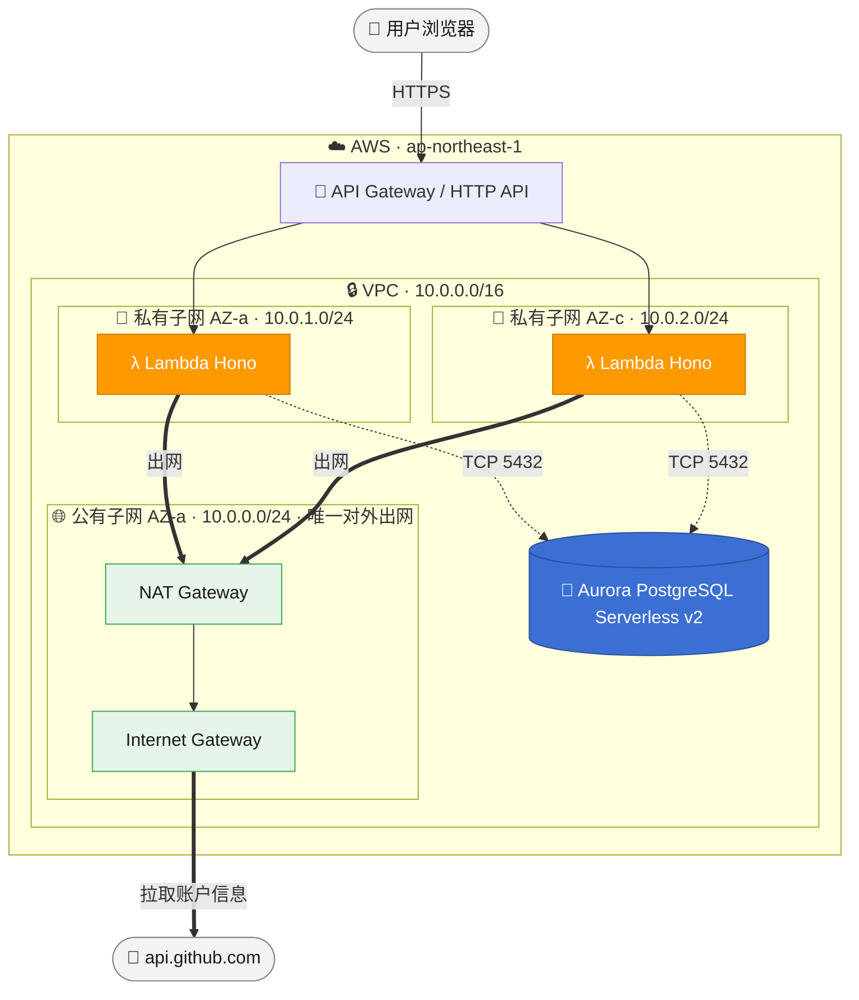
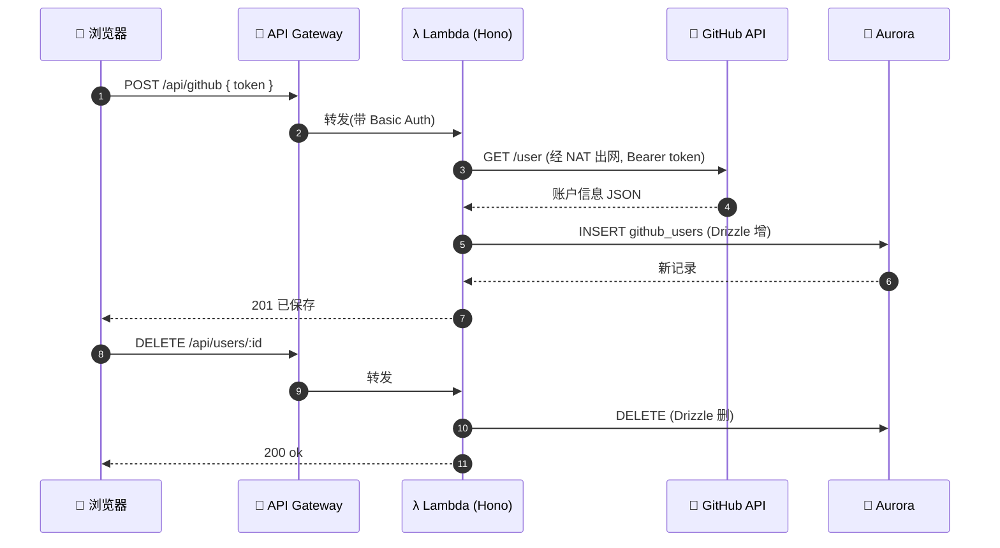

# 作业实现说明

> GitHub 账户信息收集 —— Hono + Drizzle + Aurora，SAM 部署到 AWS，GitHub Actions(OIDC) 自动化。

## 技术栈

Better-T-Stack 的 **pnpm monorepo**：Hono(后端) + React Router(前端，本作业用 Hono 直出页面) + **Drizzle ORM** + PostgreSQL，TypeScript 全栈，tsdown 打包。部署目标 **AWS（SAM / 基础设施即代码）**，区域 `ap-northeast-1`。

## 五条要求对照

| # | 要求 | 实现 | 关键文件 |
|---|---|---|---|
| 1 | Hono 一个接口 + 一个页面，SAM 部署到 AWS | Hono 单 app 同时出页面(`GET /`)和接口；打成 Lambda 经 API Gateway 暴露 | `apps/server/src/app.ts`、`page.ts`、`lambda.ts`、`template.yaml` |
| 2 | 表单用个人 token 取 GitHub 信息 + Drizzle 增删 | 表单提交 token → 后端调 `api.github.com/user` → Drizzle 入库(增)/删除记录(删) | `github.ts`、`packages/db/src/schema/github-users.ts` |
| 3 | SAM 部署，服务+DB 同 VPC（1 子网出网 + 2 子网部署 Lambda） | 自建 VPC：1 公有子网(IGW+NAT) + 2 私有子网(Lambda+Aurora 同 VPC) | `template.yaml` |
| 4 | GitHub Actions + IAM 权限部署 | OIDC 角色(免长期密钥) + 一次性 bootstrap 建角色/边界 | `.github/workflows/deploy.yml`、`infra/github-oidc.yaml` |
| 5 | 自己的 JS 工作流完成开发 | pnpm workspace + tsdown 把 Lambda 打成自包含单文件 | `tsdown.config.ts` |

## 架构



> 实线=请求链路，虚线=连库(5432)，粗线=经 NAT 出网到 GitHub。三个子网：1 个公有(放 NAT，唯一出网) + 2 个私有(部署 Lambda 与 Aurora)。

## 请求 / 数据流

1. 浏览器打开页面 → Basic Auth 登录
2. 表单填入 GitHub Personal Token → `POST /api/github`
3. Lambda **经 NAT 出网**调 `https://api.github.com/user`
4. 账户信息用 **Drizzle 写入 Aurora**（增）；列表 `GET /api/users`；`DELETE /api/users/:id`（删）
5. Lambda 冷启动时 `ensureSchema()` 幂等建表（在私有子网内完成，CI 无需直连库）



## 接口一览

| 方法 | 路径 | 说明 |
| --- | --- | --- |
| GET | `/` | 表单页面 |
| POST | `/api/github` | 用 token 拉 GitHub 账户并入库（增） |
| GET | `/api/users` | 列出已保存账户 |
| DELETE | `/api/users/:id` | 删除一条记录（删） |
| GET | `/health` | 健康检查（免鉴权） |

## 安全加固（作业之外，满足代码审查门）

- **Basic Auth**：页面 + 所有接口受保护，`/health` 放行；密码由 SAM 生成、不入仓库
- **OIDC 免密钥**：CI 临时假设角色，仓库不存 AccessKey/SecretKey；信任收窄到 `main`/`master` 分支
- **权限边界防提权**：部署角色只能创建"挂了权限边界"的 Lambda 角色，实际权限封顶在 `logs + ec2(ENI)`，且边界由 admin 持有、CI 无权修改
- IAM 按区域 + 资源前缀收窄，`PassRole` 限定 `lambda.amazonaws.com`

## 线上验证（已实测通过）

| 验证项 | 结果 |
|---|---|
| API Gateway → Lambda | `/health` 200 |
| 鉴权网关 | 无凭据 401 / 正确凭据 200 |
| **Lambda → Aurora（私有子网连库 + 自动建表）** | `/api/users` 返回 `[]` |
| **Lambda → NAT → GitHub（出网）** | 假 token 拿到真实 401 |
| 参数校验 | 空 token 400 |

线上地址：`https://e7qrl1cohh.execute-api.ap-northeast-1.amazonaws.com`

## 部署方式（两条路径）

### 手动部署

```bash
pnpm install
pnpm --filter server build     # 产出自包含 apps/server/dist/lambda.mjs
sam deploy                     # 读取 samconfig.toml（region: ap-northeast-1）
```

### CI 自动部署

1. 一次性建 OIDC 角色 + 权限边界：
   ```bash
   aws cloudformation deploy \
     --region ap-northeast-1 \
     --stack-name github-oidc-deployer \
     --capabilities CAPABILITY_NAMED_IAM \
     --template-file infra/github-oidc.yaml \
     --parameter-overrides GitHubOrg=PrettyKing GitHubRepo=github-repositories-fllow
   ```
2. 把输出的 `DeployRoleArn` 存到 GitHub 仓库 Secret `AWS_DEPLOY_ROLE_ARN`
3. push 到 `main`/`master` 即触发 `.github/workflows/deploy.yml`：构建 → OIDC 假设角色 → `sam validate` → `sam deploy`

### 取登录密码

```bash
aws secretsmanager get-secret-value --region ap-northeast-1 \
  --secret-id "<部署输出的 AuthSecretArn>" --query SecretString --output text
```

### 拆栈省钱（验收后）

```bash
sam delete --stack-name github-repositories-fllow --region ap-northeast-1
# bootstrap 栈是免费 IAM 资源，可留；清干净则：
aws cloudformation delete-stack --stack-name github-oidc-deployer --region ap-northeast-1
```

## 踩坑记录

1. **RDS / EC2 的 description 字段不能含中文** —— 非 ASCII 控制字符会让 CloudFormation 创建子网组 / 安全组失败、整栈回滚。改成英文即可（`DBSubnetGroupDescription`、安全组 `GroupDescription`）。
2. **`CORS_ORIGIN="*"` 过不了 `z.url()` 校验** —— Lambda 冷启动 env 校验直接抛错、所有请求失败。需放宽为 `z.union([z.literal("*"), z.url()])`。
3. **Lambda 在私有子网，CI 连不到库** —— 建表改由 Lambda 冷启动 `ensureSchema()` 幂等执行，而非 CI 跑 migration。
4. **VPC 自带的主路由表(main route table)** —— AWS 每个 VPC 自动创建一张，模板显式建了 public/private 两张并关联全部子网，主表空置属正常、免费、删不掉。
