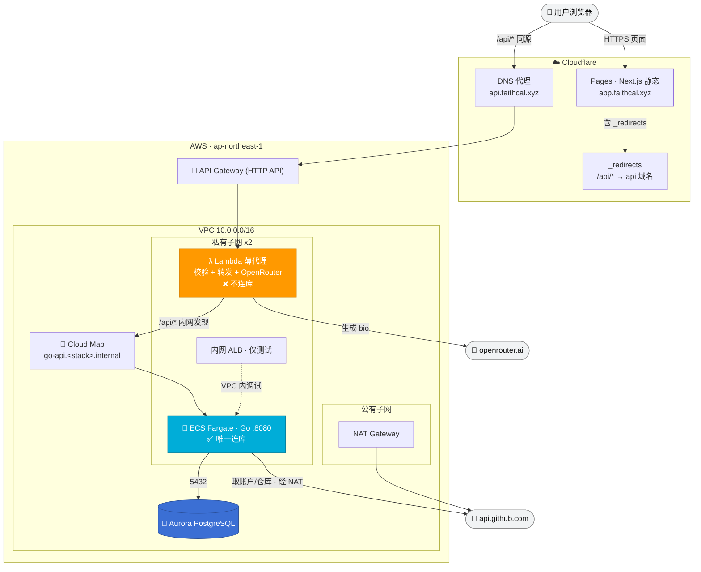
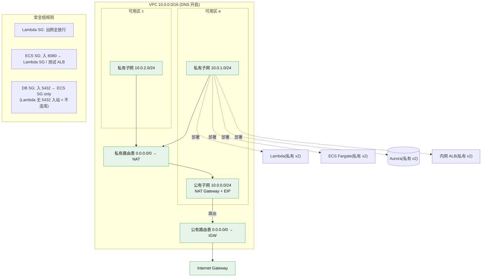
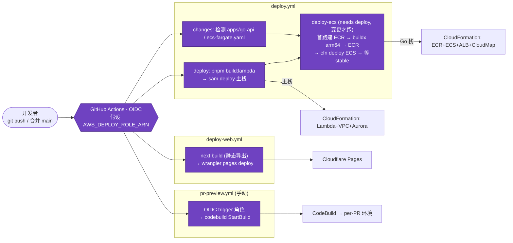
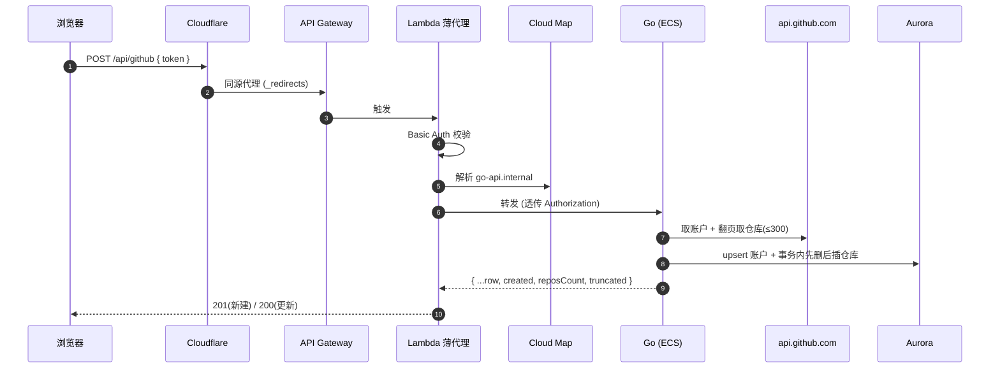
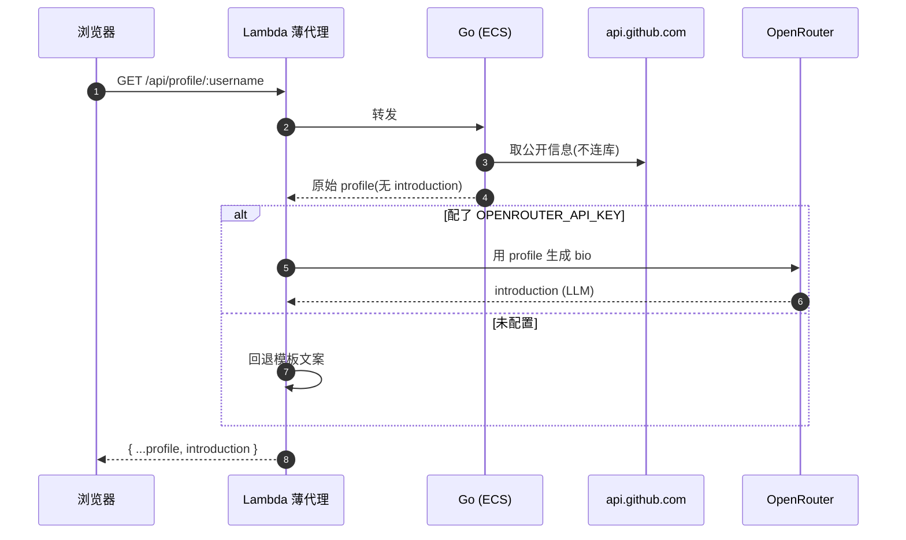
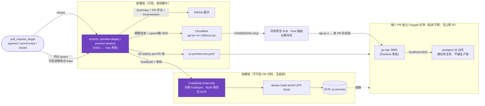
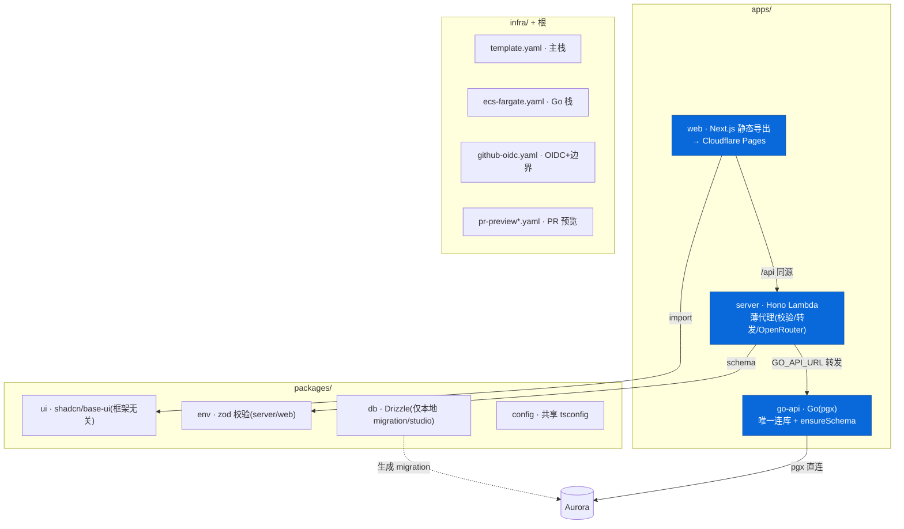
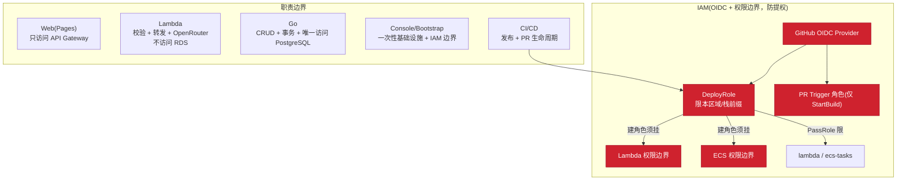

# 项目架构图（多角度）

> 对齐后的当前架构。区域 `ap-northeast-1`。核心原则：
> **Web 只访问 API Gateway；Lambda 只做校验/转发/OpenRouter、不连库；Go 是唯一 DB 访问方；ALB 仅测试。**

---

## 1. 生产运行链路（总览）

---

## 2. 网络 / VPC 拓扑

---

## 3. CI/CD 部署流程

---

## 4. 请求时序 — 添加账户 `POST /api/github`

## 4b. 请求时序 — 生成个人介绍 `GET /api/profile/:username`

---

## 5. 基于 PR 的独立预览环境

**分权安全模型（P0）**：构建(不可信 PR 代码)与部署(密钥)彻底分离。
- **构建域**：CodeBuild 用**内联 buildspec**(PR 改不了步骤)，Build 角色**只能 push ECR、无任何密钥/部署权限**。
- **部署域**：`pull_request_target` 触发的**可信** workflow(逻辑来自 base 分支)经 OIDC 假设 **Ops 角色**做 cfn 部署/销毁 + 读 Cloudflare 密钥 + PassRole；**fork PR 被 same-repo guard 挡掉**。
- **三个 IAM 角色**：Ops(Actions 假设)、Build(CodeBuild，仅 ECR)、Runtime(预览任务)。清理失败(`DELETE_FAILED`)会让 destroy 工作流报错，不被吞掉。
- **稳定入口(P5)**：每 PR 任务在私有子网、无公网 IP；入口走**长期共享 ALB**(Host 路由 `api-pr-<n>` → 各 PR 目标组)，Cloudflare DNS-only CNAME 指过来 → `http://api-pr-<n>.faithcal.xyz`(无端口)。任务 IP 变化被目标组屏蔽。
- **兜底清扫(P4)**：per-PR 栈打 `Environment=preview`/`PullRequest`/`ExpiresAt` 标签；`preview-reconcile.yml` 每晚扫描，删除「PR 已关闭」或「已过期」的孤儿栈+DNS，限制成本泄漏。

---

## 6. Monorepo / 组件结构

---

## 7. 职责边界 / 权限模型

---

## 与部署实例的对应

- 前端：`https://app.faithcal.xyz`（Cloudflare Pages）
- API：`https://api.faithcal.xyz` → API Gateway（或默认 `https://<id>.execute-api.ap-northeast-1.amazonaws.com`）
- 数据流：`Web → CF → API Gateway → Lambda → Cloud Map → Go(ECS) → Aurora`；bio 走 `Lambda → OpenRouter`
- 详细部署顺序见 `docs/部署清单.md`；踩坑与决策见 `specs/LESSONS.md`。

