# 项目架构图

## ImageGen 完整项目架构图

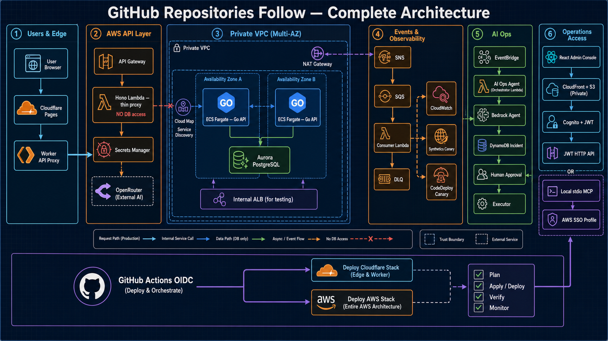

> 该图用于方案汇报和整体介绍；下方 Mermaid 图用于版本化维护精确的拓扑、时序和职责边界。

## ImageGen AWS 巡检、事件驱动、灰度发布与 AI Ops Agent

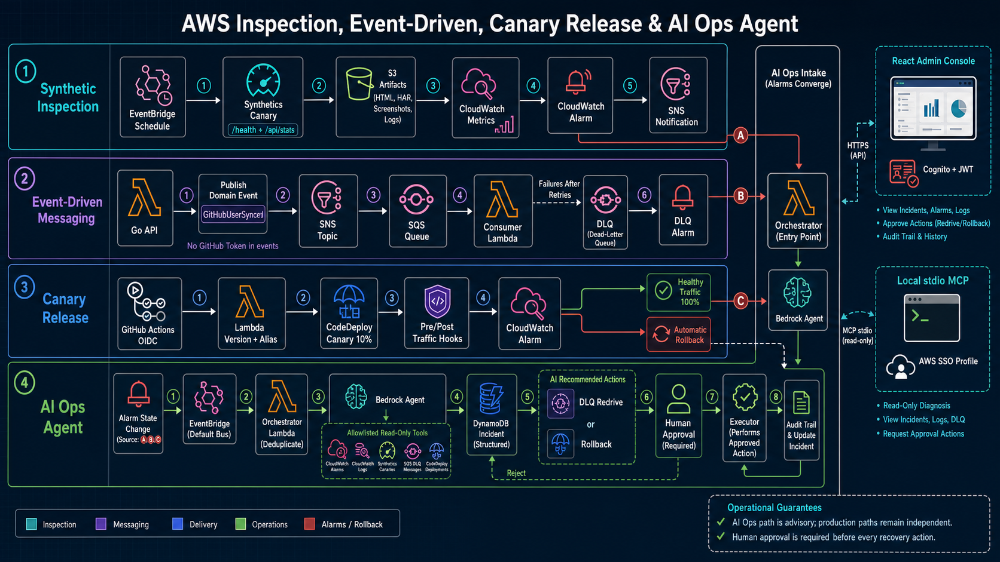

> 运维闭环图重点展示 Synthetics 巡检、SNS/SQS/DLQ、CodeDeploy Canary、告警汇聚、Agent 诊断、人审恢复、React Console 和本地 MCP。

---

## 1. 生产运行链路（总览）

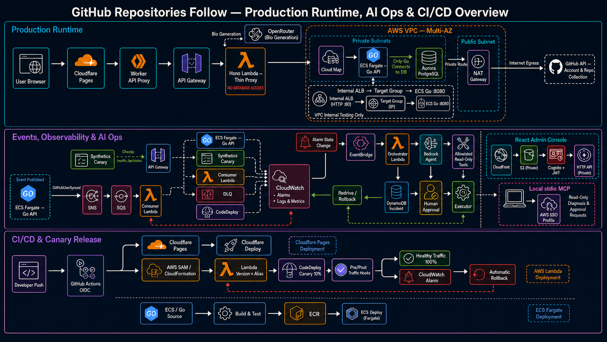

> ImageGen 总览图同时覆盖生产请求链路、事件与可观测性、AI Ops 人审恢复闭环，以及 Cloudflare/AWS/Lambda/ECS 的 CI/CD 灰度发布路径。

---

## 2. 网络 / VPC 拓扑

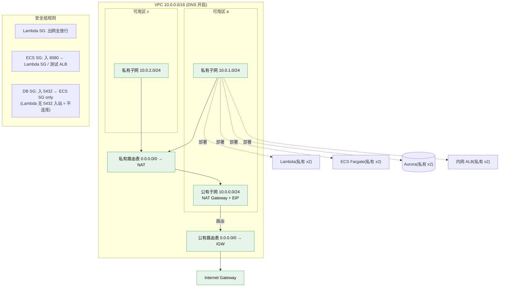

---

## 3. CI/CD 部署流程

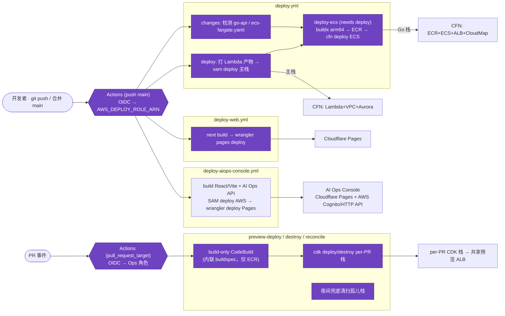

---

## 4. 请求时序 — 添加账户 `POST /api/github`

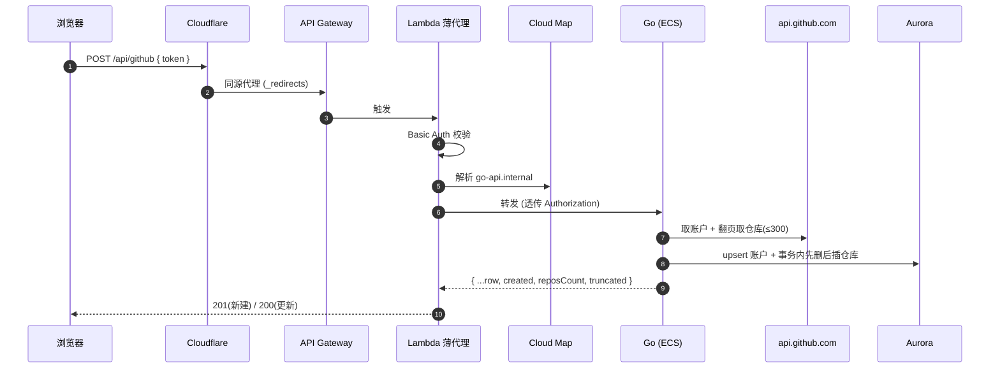

## 4b. 请求时序 — 生成个人介绍 `GET /api/profile/:username`

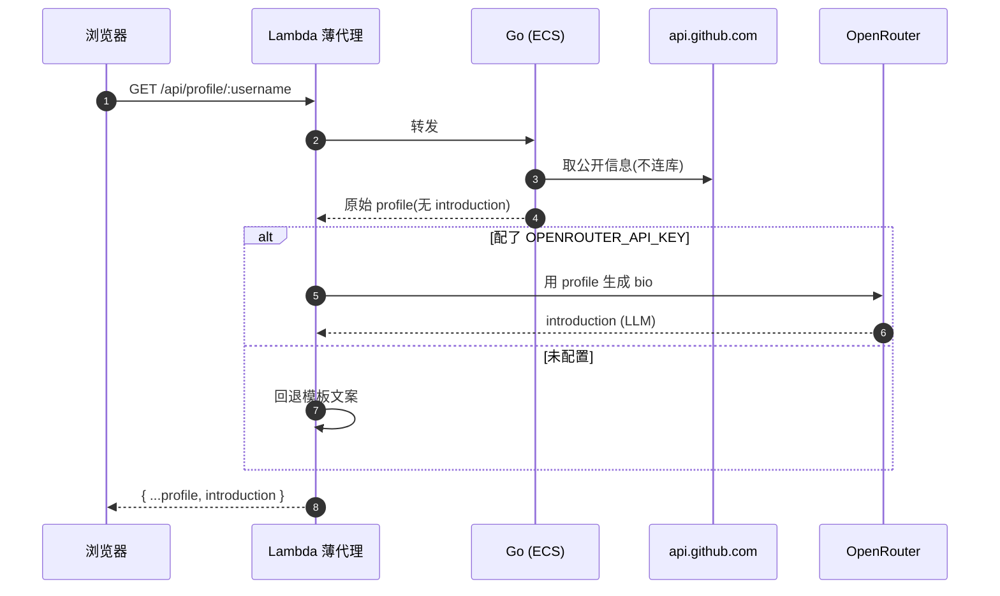

---

## 5. 基于 PR 的独立预览环境

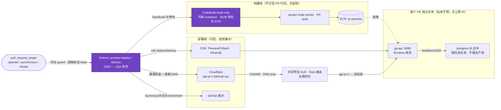

**分权安全模型**：构建(不可信 PR 代码)与部署(密钥)彻底分离。
- **构建域**：CodeBuild 用**内联 buildspec**(PR 改不了步骤)，Build 角色**只能 push ECR、无任何密钥/部署权限**。
- **部署域**：`pull_request_target` 触发的**可信** workflow(逻辑来自 base 分支)经 OIDC 假设 **Ops 角色**做 cfn 部署/销毁 + 读 Cloudflare 密钥 + PassRole；**fork PR 被 same-repo guard 挡掉**。
- **三个 IAM 角色**：Ops(Actions 假设)、Build(CodeBuild，仅 ECR)、Runtime(预览任务)。清理失败(`DELETE_FAILED`)会让 destroy 工作流报错，不被吞掉。
- **稳定入口**：每 PR 任务在私有子网、无公网 IP；入口走**长期共享 ALB**(Host 路由 `api-pr-<n>` → 各 PR 目标组)，Cloudflare DNS-only CNAME 指过来 → `http://api-pr-<n>.faithcal.xyz`(无端口)。任务 IP 变化被目标组屏蔽。
- **兜底清扫**：per-PR 栈打 `Environment=preview`/`PullRequest`/`ExpiresAt` 标签；`preview-reconcile.yml` 每晚扫描，删除「PR 已关闭」或「已过期」的孤儿栈+DNS，限制成本泄漏。

---

## 6. Monorepo / 组件结构

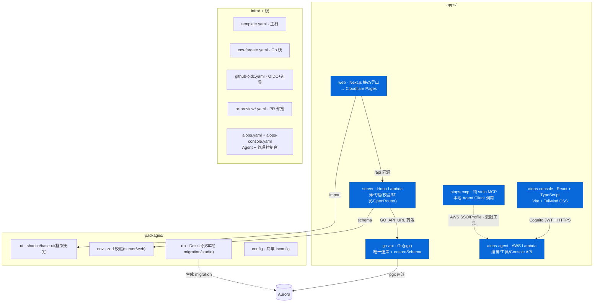

---

## 7. 职责边界 / 权限模型

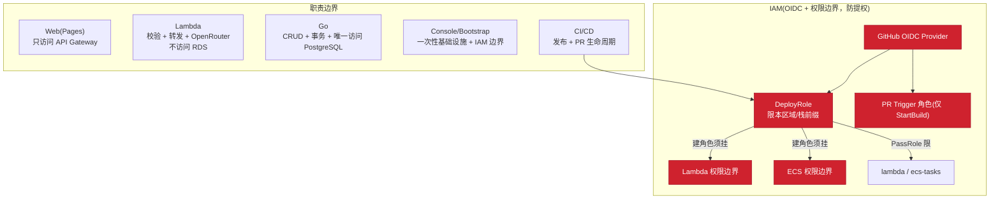

---

## 8. AI Ops Console 与本地 MCP

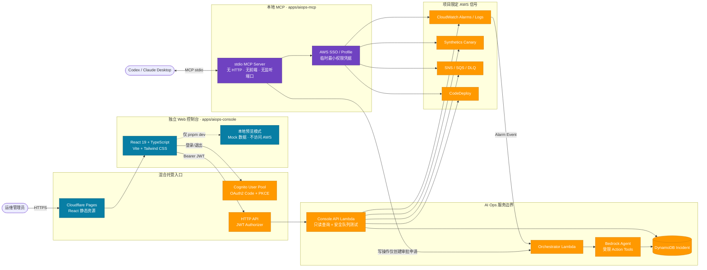

### 边界说明

- `aiops-console` 是独立的 React 管理控制台，不属于 `aiops-mcp`，也不向浏览器下发 AWS 凭据。
- 线上静态资源由 Cloudflare Pages 托管；AWS Cognito 完成管理员认证，HTTP API JWT Authorizer 保护 Console API。
- 本地 `pnpm --filter aiops-console dev` 默认使用安全 Mock 数据，端口为 `4322`；不会访问或修改 AWS。
- `aiops-mcp` 只使用 stdio 与 MCP Client 通信，没有 Web 页面、HTTP Server 或固定端口。
- Console API 和 MCP 都只能访问环境 allowlist 内的告警、日志组、Canary、队列和部署组；恢复类写操作仍需审批。
