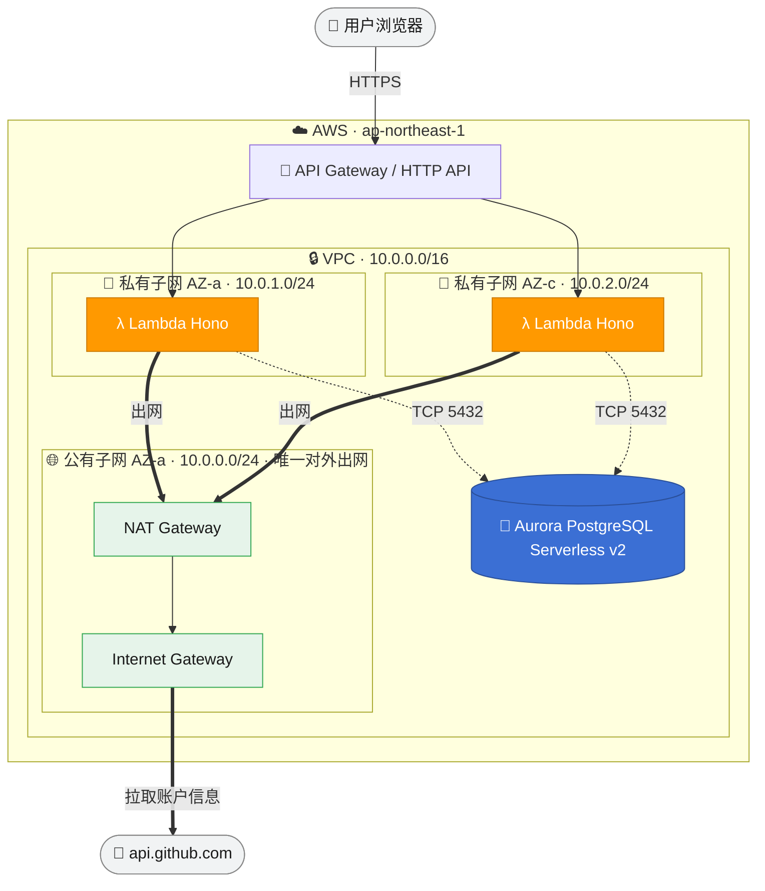
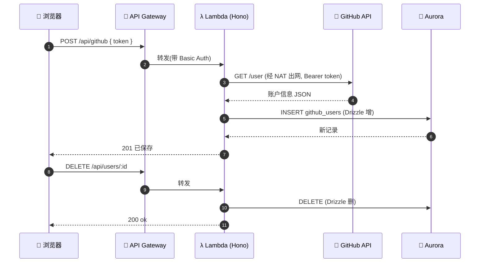
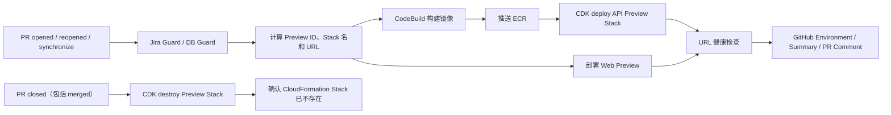

# 需求说明

> 合并自三份文档：第一次作业说明、账户/仓库收集增强需求（v2）、PR 预览环境方案（CodeBuild + CDK）。
> 系统**当前架构以 `docs/架构图.md` 为准**；本文侧重需求与方案演进。结构化开发规格见 `specs/`。

---

## 作业实现说明

> ⚠️ **历史快照（第一次作业，2026-06-28）**：描述的是最初的「单 Hono app 直出页面 + Lambda 直连 Aurora」实现。
> 项目后续已做数据流倒置对齐（Lambda 薄代理 → Cloud Map → Go 唯一连库）+ 前端迁 Next.js/Cloudflare Pages。
> **当前架构以 `docs/架构图.md` 为准**，本文仅作最初交付的存档。

> GitHub 账户信息收集 —— Hono + Drizzle + Aurora，SAM 部署到 AWS，GitHub Actions(OIDC) 自动化。

### 技术栈

Better-T-Stack 的 **pnpm monorepo**：Hono(后端) + React Router(前端，本作业用 Hono 直出页面) + **Drizzle ORM** + PostgreSQL，TypeScript 全栈，tsdown 打包。部署目标 **AWS（SAM / 基础设施即代码）**，区域 `ap-northeast-1`。

### 五条要求对照

| # | 要求 | 实现 | 关键文件 |
|---|---|---|---|
| 1 | Hono 一个接口 + 一个页面，SAM 部署到 AWS | Hono 单 app 同时出页面(`GET /`)和接口；打成 Lambda 经 API Gateway 暴露 | `apps/server/src/app.ts`、`page.ts`、`lambda.ts`、`template.yaml` |
| 2 | 表单用个人 token 取 GitHub 信息 + Drizzle 增删 | 表单提交 token → 后端调 `api.github.com/user` → Drizzle 入库(增)/删除记录(删) | `github.ts`、`packages/db/src/schema/github-users.ts` |
| 3 | SAM 部署，服务+DB 同 VPC（1 子网出网 + 2 子网部署 Lambda） | 自建 VPC：1 公有子网(IGW+NAT) + 2 私有子网(Lambda+Aurora 同 VPC) | `template.yaml` |
| 4 | GitHub Actions + IAM 权限部署 | OIDC 角色(免长期密钥) + 一次性 bootstrap 建角色/边界 | `.github/workflows/deploy.yml`、`infra/github-oidc.yaml` |
| 5 | 自己的 JS 工作流完成开发 | pnpm workspace + tsdown 把 Lambda 打成自包含单文件 | `tsdown.config.ts` |

### 架构



> 实线=请求链路，虚线=连库(5432)，粗线=经 NAT 出网到 GitHub。三个子网：1 个公有(放 NAT，唯一出网) + 2 个私有(部署 Lambda 与 Aurora)。

### 请求 / 数据流

1. 浏览器打开页面 → Basic Auth 登录
2. 表单填入 GitHub Personal Token → `POST /api/github`
3. Lambda **经 NAT 出网**调 `https://api.github.com/user`
4. 账户信息用 **Drizzle 写入 Aurora**（增）；列表 `GET /api/users`；`DELETE /api/users/:id`（删）
5. Lambda 冷启动时 `ensureSchema()` 幂等建表（在私有子网内完成，CI 无需直连库）



### 接口一览

| 方法 | 路径 | 说明 |
| --- | --- | --- |
| GET | `/` | 表单页面 |
| POST | `/api/github` | 用 token 拉 GitHub 账户并入库（增） |
| GET | `/api/users` | 列出已保存账户 |
| DELETE | `/api/users/:id` | 删除一条记录（删） |
| GET | `/health` | 健康检查（免鉴权） |

### 安全加固（作业之外，满足代码审查门）

- **Basic Auth**：页面 + 所有接口受保护，`/health` 放行；密码由 SAM 生成、不入仓库
- **OIDC 免密钥**：CI 临时假设角色，仓库不存 AccessKey/SecretKey；信任收窄到 `main`/`master` 分支
- **权限边界防提权**：部署角色只能创建"挂了权限边界"的 Lambda 角色，实际权限封顶在 `logs + ec2(ENI)`，且边界由 admin 持有、CI 无权修改
- IAM 按区域 + 资源前缀收窄，`PassRole` 限定 `lambda.amazonaws.com`

### 线上验证（已实测通过）

| 验证项 | 结果 |
|---|---|
| API Gateway → Lambda | `/health` 200 |
| 鉴权网关 | 无凭据 401 / 正确凭据 200 |
| **Lambda → Aurora（私有子网连库 + 自动建表）** | `/api/users` 返回 `[]` |
| **Lambda → NAT → GitHub（出网）** | 假 token 拿到真实 401 |
| 参数校验 | 空 token 400 |

线上地址：`https://e7qrl1cohh.execute-api.ap-northeast-1.amazonaws.com`

### 部署方式（两条路径）

#### 手动部署

```bash
pnpm install
pnpm --filter server build     # 产出自包含 apps/server/dist/lambda.mjs
sam deploy                     # 读取 samconfig.toml（region: ap-northeast-1）
```

#### CI 自动部署

1. 一次性建 OIDC 角色 + 权限边界：
   ```bash
   aws cloudformation deploy \
     --region ap-northeast-1 \
     --stack-name github-oidc-deployer \
     --capabilities CAPABILITY_NAMED_IAM \
     --template-file infra/github-oidc.yaml \
     --parameter-overrides GitHubOrg=PrettyKing GitHubRepo=github-repositories-fllow
   ```
2. 把输出的 `DeployRoleArn` 存到 GitHub 仓库 Secret `AWS_DEPLOY_ROLE_ARN`
3. push 到 `main`/`master` 即触发 `.github/workflows/deploy.yml`：构建 → OIDC 假设角色 → `sam validate` → `sam deploy`

#### 取登录密码

```bash
aws secretsmanager get-secret-value --region ap-northeast-1 \
  --secret-id "<部署输出的 AuthSecretArn>" --query SecretString --output text
```

#### 拆栈省钱（验收后）

```bash
sam delete --stack-name github-repositories-fllow --region ap-northeast-1
# bootstrap 栈是免费 IAM 资源，可留；清干净则：
aws cloudformation delete-stack --stack-name github-oidc-deployer --region ap-northeast-1
```

### 踩坑记录

1. **RDS / EC2 的 description 字段不能含中文** —— 非 ASCII 控制字符会让 CloudFormation 创建子网组 / 安全组失败、整栈回滚。改成英文即可（`DBSubnetGroupDescription`、安全组 `GroupDescription`）。
2. **`CORS_ORIGIN="*"` 过不了 `z.url()` 校验** —— Lambda 冷启动 env 校验直接抛错、所有请求失败。需放宽为 `z.union([z.literal("*"), z.url()])`。
3. **Lambda 在私有子网，CI 连不到库** —— 建表改由 Lambda 冷启动 `ensureSchema()` 幂等执行，而非 CI 跑 migration。
4. **VPC 自带的主路由表(main route table)** —— AWS 每个 VPC 自动创建一张，模板显式建了 public/private 两张并关联全部子网，主表空置属正常、免费、删不掉。

---

## 需求说明 — GitHub 账户/仓库收集增强（v2）

> 文档版本 v1 ｜ 2026-06-28 ｜ 在现有「GitHub 账户信息收集」之上的功能增强。
> 现状基线：表单提交个人 token → 调 `api.github.com/user` 取基础资料 → Drizzle **insert-only** 入库（重复提交会反复新增）→ 列表展示 / 按 id 删除。仅一张 `github_users` 表，无仓库数据、无去重、无统计。

### 背景与目标

当前实现能跑通「取账户 → 存 → 列 → 删」，但存在三处明显短板：

1. 项目名为 *github-repositories-fllow*，却**没有收集任何仓库信息**。
2. 同一账户**重复提交会产生脏数据**，且资料过期后无法刷新。
3. 收集到的数据**缺乏总览**，无法快速看出规模与分布。

本次目标：补齐**仓库收集（A）**、**去重与刷新同步（B）**、**聚合统计面板（E）**三项，使数据可靠、内容完整、结果可洞察。

### 范围与约束

- 保持现有架构：**单 Hono app 直出页面与接口**，不启用 `apps/web` 的 React 前端。
- 统计面板**不引入图表库**，用纯文本 + CSS 进度条呈现（零新增依赖）。
- 数据库沿用 Aurora PostgreSQL + Drizzle；**新增/修改 schema 时必须同步 `ensureSchema()` 的 DDL 与 drizzle migration**（见 `specs/LESSONS.md` 踩坑 3）。
- 鉴权延续 Basic Auth：新增的页面与 `/api/*` 接口同样受保护，`/health` 仍放行。
- GitHub token 延续「一次性透传、不持久化」原则。

---

### 功能 A：仓库信息收集与展示

#### 用户故事
- 作为用户，我提交 token 后希望同时收集我的仓库列表，以便了解账户下的项目概况。
- 作为用户，我希望在某个账户下展开查看其仓库（名称、语言、star/fork、更新时间、是否私有），并能链接到 GitHub 原页。

#### 功能需求
- A1. 提交 token 取账户资料的同时，调 `GET /user/repos?per_page=100&sort=updated&type=owner` 拉取该账户仓库，**处理分页**（按 `Link` 头翻页，或至少拉前 N 页并标注）。
- A2. 新增 `github_repos` 表，至少含：所属账户外键、`repo_id`(GitHub id)、`name`、`full_name`、`html_url`、`description`、`language`、`stargazers_count`、`forks_count`、`is_private`、`pushed_at`、`created_at`(入库时间)。
- A3. 列表页每个账户可展开/折叠其仓库卡片，展示语言、star、fork、更新时间，名称链接到 `html_url`。
- A4. 删除账户时级联删除其仓库记录（外键 `ON DELETE CASCADE` 或应用层级联）。
- A5. 提供 `GET /api/users/:id/repos` 返回某账户的仓库列表（供页面展开时按需加载）。

#### 验收标准
- [ ] 提交一个含公开仓库的 token 后，`github_repos` 有对应记录，页面能展开看到。
- [ ] 仓库数 > 100 的账户能拿到第一页之外的数据（或明确标注「仅展示前 N 个」）。
- [ ] 删除账户后其仓库记录一并消失，无孤儿数据。

---

### 功能 B：提交去重 + 刷新同步

#### 用户故事
- 作为用户，我重复提交同一账户时，希望系统**更新现有记录而非新增重复行**。
- 作为用户，我希望对已收集账户点「刷新」，重新拉取最新资料与仓库。

#### 功能需求
- B1. `github_users.github_id` 增加**唯一约束**；新增 `updated_at` 列（每次写入刷新）。
- B2. `POST /api/github` 改为 **upsert**：按 `github_id` 命中则更新各字段与 `updated_at`，否则插入；返回时区分「新建 / 更新」。
- B3. 新增 `POST /api/users/:id/refresh`：用**当次请求传入的 token** 重新取数并更新该账户（及其仓库，配合 A）。token 仍不持久化。
- B4. 列表展示每条记录的「最近更新时间」，每行提供「刷新」入口（需重新填 token）。
- B5. upsert 与唯一约束需同步到 `ensureSchema()` 的 DDL 与 migration。

#### 验收标准
- [ ] 同一 token 连续提交两次，`github_users` 只有一行，`updated_at` 被刷新。
- [ ] 对已有账户刷新后，变化的字段（如 followers、仓库数）被更新。
- [ ] 旧数据迁移：已存在的重复行有明确处理策略（去重保留最新 / 文档说明）。

---

### 功能 E：聚合统计面板

#### 用户故事
- 作为用户，我希望在页面顶部看到已收集数据的总览，以便快速判断规模与分布。

#### 功能需求
- E1. 新增 `GET /api/stats`，用 Drizzle 聚合返回：账户总数、仓库总数、followers 总和、public_repos 总和、Top 5 账户（按 followers）、语言分布 Top N（依赖 A 的仓库数据）。
- E2. 页面顶部渲染统计区：关键数字 + 语言分布用 **CSS 进度条**（占比）呈现，无图表库。
- E3. 统计为只读，随列表数据变化刷新（页面加载或操作后重新拉取）。

#### 验收标准
- [ ] 空数据时面板显示 0 / 空态，不报错。
- [ ] 收集多个账户后，总数、求和、Top N、语言占比数值正确。
- [ ] 语言分布进度条占比之和合理（约 100%，可含「其他」）。

---

### 接口增量一览

| 方法 | 路径 | 说明 | 关联功能 |
| --- | --- | --- | --- |
| POST | `/api/github` | 改为 upsert（去重） | B |
| GET | `/api/users/:id/repos` | 某账户的仓库列表 | A |
| POST | `/api/users/:id/refresh` | 重新取数更新（传 token） | A+B |
| GET | `/api/stats` | 聚合统计 | E |
| DELETE | `/api/users/:id` | 级联删除仓库（行为增强） | A |

### 数据模型增量

- `github_users`：新增 `updated_at`；`github_id` 加唯一约束。
- 新增 `github_repos`：见 A2，外键关联 `github_users.id`，`ON DELETE CASCADE`。

### 非功能需求

- **性能**：批量拉仓库注意 GitHub 速率限制；统计聚合走 SQL，不在应用内全表遍历。
- **安全**：新接口同受 Basic Auth；token 不入库不打日志。
- **一致性**：schema 变更同步 `ensureSchema` DDL 与 migration，避免线上线下漂移。

### 依赖与风险

- GitHub API：`GET /user/repos`、`GET /users/{login}/repos`，分页与速率限制。
- 旧重复数据迁移策略需在开发时明确（建议：上线唯一约束前先去重）。
- 仓库数据量增大后页面渲染性能（按需加载 / 折叠缓解）。

### 开放问题（开发前确认）

1. 仓库收集是否包含 fork 的仓库？（默认 `type=owner`，不含他人 fork 来的；可调）
2. 仓库分页拉取上限：全量翻页 vs 仅前 N 个（默认上限如 300，超出标注）？
3. 旧重复数据处理：自动去重保留最新 vs 保留全部仅对新提交去重？

---

## PR 预览环境：CodeBuild + CDK 方案讨论总结

### 1. 目标

为每个 Pull Request 创建一套可独立访问的临时预览环境：

- PR 打开、重新打开或提交更新时，自动构建并部署。
- 根据 PR 编号计算稳定、唯一的环境名称和访问 URL。
- 将前端、API 访问地址展示在本次 GitHub Actions、GitHub Deployment 和 PR 评论中。
- PR 合并或关闭后，通过 CDK 立即销毁该 PR 对应的资源。
- 预览环境不访问生产数据库，且具备失败重试、并发控制和残留资源清扫能力。

本文是目标方案讨论，不代表仓库已经切换到 CDK。仓库当前 PR Preview 仍以 CodeBuild + CloudFormation 模板实现。

### 2. 推荐流程



建议把部署和销毁拆成两条工作流：

1. `preview-deploy.yml`
   - 监听 `opened`、`reopened`、`synchronize`。
   - 计算环境名称和 URL。
   - 构建镜像，部署 API 与 Web。
   - 做健康检查并发布访问地址。
2. `preview-destroy.yml`
   - 监听 `closed`。
   - 从默认分支获取可信 CDK 程序。
   - 销毁该 PR 的 Stack，并验证删除结果。

GitHub 中合并 PR 也会触发 `closed`，因此通常不需要单独处理 `merged`；无论合并还是放弃 PR，都应清理预览环境。

### 3. 命名与 URL 计算

应使用 PR number 作为资源主键。分支名可能包含 `/`、`_`、大写字母或过长的描述，不适合直接用于 AWS 资源命名。

例如 PR `#222`：

```text
PREVIEW_ID=pr-222
STACK_NAME=yideng-preview-pr-222
IMAGE_TAG=pr-222-<commit-sha>

WEB_URL=https://pr-222.preview.yideng.ai
API_URL=https://api-pr-222.preview.yideng.ai
```

如果必须沿用现有命名，可以计算为：

```text
API_URL=https://yideng-q222-de-rd.yideng.ai
WEB_URL=https://yideng-q222-dev-fe.yideng.ai
```

但推荐使用 `preview.yideng.ai` 作为统一预览域，便于配置 wildcard DNS 和证书：

```text
*.preview.yideng.ai
*.api.preview.yideng.ai
```

只要 URL 完全由 PR number 决定，就可以在部署开始前计算。前后端可并行部署，不必等待 CDK 输出后才开始构建前端。

### 4. 在 GitHub 中展示 URL

建议同时使用以下三种方式。

#### 4.1 GitHub Environment URL

部署 Job 绑定动态 Environment：

```text
Environment: preview-pr-222
URL: https://pr-222.preview.yideng.ai
```

GitHub 会将其记录为 Deployment，并显示 `View deployment`。URL 最好由前置 `prepare` Job 计算，再通过 Job Output 传给部署 Job。

CDK 只能删除 AWS 资源，不能自动删除 GitHub Environment。如需同时清理 Environment，需要调用 GitHub API。

#### 4.2 Actions Job Summary

部署完成后向 `$GITHUB_STEP_SUMMARY` 写入：

```markdown
## PR Preview

| Component | URL |
| --- | --- |
| Web | https://pr-222.preview.yideng.ai |
| API | https://api-pr-222.preview.yideng.ai |
```

#### 4.3 PR 固定评论

创建或更新同一条机器人评论，而不是每次提交都新增评论：

```text
Preview deployed

Web: https://pr-222.preview.yideng.ai
API: https://api-pr-222.preview.yideng.ai
Commit: <sha>
```

评论中可加入隐藏标识，供后续查找和更新：

```html
<!-- pr-preview-environment -->
```

PR 关闭并完成清理后，将评论更新为 `Preview removed`。

### 5. CDK Stack 划分

不建议每个 PR 重建 VPC、NAT、ECR、ALB 等昂贵资源。应分为长期共享层和临时 PR 层。

#### 5.1 共享基础设施

`PreviewPlatformStack` 长期存在：

- VPC 和子网。
- 共享 ECS Cluster。
- 共享 ALB 或 API Gateway。
- ECR Repository。
- Wildcard DNS 和 ACM Certificate。
- CodeBuild 项目。
- IAM Role。

#### 5.2 每 PR 临时资源

`PreviewPr222Stack` 随 PR 创建和销毁：

- ECS Task Definition。
- ECS Service。
- ALB Target Group 和 Host Listener Rule。
- CloudWatch Log Group。
- 临时数据库、独立 database/schema 或 mock 数据。
- 必要的 Parameter 和 Secret。

生命周期示意：

```text
cdk deploy PreviewPr222Stack
cdk destroy PreviewPr222Stack --force
```

如果使用 API Gateway，可根据域名或路径路由。浏览器预览更推荐 Host 路由：

```text
api-pr-222.preview.yideng.ai -> PR #222 API
```

Header 分发适合服务间调用，但不利于用户直接打开链接，也会增加前端和调试工具的特殊配置。

### 6. CodeBuild、GitHub Actions 与 CDK 的职责

```text
GitHub Actions
├── 读取 PR 事件
├── 计算 Preview ID 和 URL
├── 执行 Jira/DB Guard
├── 触发并等待 CodeBuild
├── 触发 CDK deploy/destroy
└── 发布 Deployment URL 和 PR 评论

CodeBuild
├── 构建业务镜像
├── 推送 ECR
└── 返回 Image URI

CDK
├── 创建或更新每 PR Stack
├── 配置 ECS、ALB/API Gateway、DNS 和日志
├── 输出访问地址
└── 销毁每 PR Stack
```

CDK 最终仍通过 CloudFormation 管理资源。所谓“使用 CDK 清理”，本质是让 CDK 用相同的 PR 参数构造出相同 Stack，并请求 CloudFormation 删除。

### 7. 数据库策略与 DB Guard

预览环境不得获得生产数据库的连接 Secret。可选方案如下：

| 方案 | 优点 | 缺点 | 适用场景 |
| --- | --- | --- | --- |
| Fargate Postgres sidecar | 成本低、PR 间隔离、不会碰生产库 | Task 替换后数据丢失 | 接口验证、短期预览 |
| 共享 RDS，每 PR 独立 database/schema | 数据相对稳定、成本可控 | 权限和清理逻辑更复杂 | 持续数日的业务验收 |
| 每 PR 独立 RDS/Aurora | 隔离最强 | 慢且昂贵 | 高隔离要求 |
| Mock/seed 数据 | 安全、快速 | 无法覆盖真实数据库行为 | 前端和多数展示场景 |

结合当前项目，短期预览优先考虑 Postgres sidecar。需要明确：它是 Task 生命周期内的临时数据库，不保证整个 PR 生命周期内持久。

DB Guard 至少检查：

- Preview 任务没有生产数据库 Secret。
- `DATABASE_URL` 明确指向临时数据库。
- Migration 是否包含高风险、破坏性变更。
- 数据库或 schema 名包含 PR number。
- PR 关闭后存在对应清理动作。

### 8. PR 关闭后的可靠清理

销毁工作流应执行以下步骤：

1. 从 `pull_request.closed` 事件读取 PR number。
2. Checkout 默认分支；关闭后 PR merge ref 可能已经不存在。
3. 使用与部署时相同的命名算法得到 Stack 名。
4. 执行 `cdk destroy <stack> --force`。
5. 等待 CloudFormation 删除完成。
6. 确认 Stack 已不存在。
7. 更新 PR 评论和 GitHub Deployment 状态。
8. 可选：通过 GitHub API 删除动态 Environment。

不能无条件忽略 `destroy` 或 CloudFormation wait 的错误。只有“Stack 原本不存在”可视为幂等成功；`DELETE_FAILED` 必须让工作流失败并报警。

CDK 中还需明确临时资源的删除策略：

- Preview 资源使用 `RemovalPolicy.DESTROY`。
- 非空 S3 Bucket 需要自动清空。
- 临时数据库不创建最终快照。
- Secret 如需立即删除，应避免默认恢复窗口阻塞清理。
- Log Group 不应默认永久保留。
- 删除 ECS Service 后，需要等待 Task 停止和 ENI 释放。

这些策略只能用于 Preview Stack，不应复用到生产 Stack。

### 9. 并发与最终一致性

必须处理以下竞态：

```text
Build A：PR synchronize，开始部署
Build B：PR closed，开始销毁
Build B：销毁完成
Build A：稍后部署完成，重新创建环境
```

建议至少采用三层保护：

1. GitHub Actions 按 `preview-pr-<number>` 设置 concurrency。
2. 部署前再次查询 PR 状态，只有 PR 仍为 open 才允许部署。
3. 定时 Reconciler 扫描带 Preview 标签的 Stack，清除已关闭或已过期的环境。

推荐给所有临时资源添加标签：

```text
Environment=preview
Repository=<owner>/<repo>
PullRequest=222
CommitSha=<sha>
ExpiresAt=<timestamp>
```

即使 GitHub Webhook、Action 或 CDK destroy 偶发失败，定时清扫也能限制资源残留和成本泄漏。

### 10. 安全边界

PR 中的代码是不可信输入，尤其需要避免以下模式：

- 从 PR 分支读取拥有部署权限的 CodeBuild buildspec。
- 直接运行 PR 分支修改过的 CDK App。
- 在构建不可信 Dockerfile 的同一权限域中暴露 Cloudflare、数据库或高权限 AWS Secret。
- 允许 fork PR 自动获得部署权限。

推荐做法：

- Buildspec、CDK App 和部署控制逻辑来自可信默认分支。
- PR commit 只作为被构建的业务代码输入。
- 构建镜像和部署资源使用不同角色，必要时拆为两个 CodeBuild 项目。
- fork PR 默认不创建环境，或使用无 Secret、极低权限的隔离项目。
- GitHub OIDC Trigger Role 只允许启动指定 CodeBuild 项目。
- CDK Deploy Role 的权限限制到 Preview 资源前缀和指定 Runtime Role。

### 11. 推荐落地版本

综合成本、体验和隔离性，推荐：

- `preview-pr-<number>` 作为统一环境标识。
- 共享 VPC、ECS Cluster、ALB、ECR、wildcard DNS。
- 每 PR 独立 ECS Service、Task Definition、Target Group、Listener Rule 和日志。
- API 使用 `api-pr-222.preview.yideng.ai`。
- Web 使用 `pr-222.preview.yideng.ai`。
- 静态前端优先使用 Cloudflare Pages Preview，不放入 ECS。
- `prepare` Job 提前计算 URL，API 与 Web 并行部署。
- 成功后写入 GitHub Environment、Actions Summary 和 PR 固定评论。
- `pull_request.closed` 触发 CDK destroy，并严格验证删除结果。
- 每晚运行一次孤儿 Stack 清扫作为兜底。

### 12. 与仓库当前实现的关系

仓库当前已经具备每 PR 独立预览环境的雏形：

- GitHub Actions 通过 OIDC 触发 CodeBuild。
- CodeBuild 构建 Go 镜像并推送 ECR。
- 每个 PR 创建独立 CloudFormation Stack。
- Fargate Task 内运行 Go API 和临时 Postgres sidecar。
- PR 关闭后删除 Stack 和 Cloudflare DNS。

如果向本文目标架构演进，优先级建议为（✅=已落地 / ⚠️=部分 / ⬜=待做）：

1. ✅ 修复不可信 PR 修改 buildspec/控制代码的安全边界。
   → CodeBuild 改**内联 buildspec + Build 角色仅 ECR、无密钥**；部署/销毁/DNS 移到 `pull_request_target` 的**可信 workflow**（逻辑来自 base 分支），密钥集中在 **Ops 角色**；**fork PR 被 same-repo guard 挡掉**。见 `infra/pr-preview.yaml`、`.github/workflows/preview-deploy.yml`、`preview-destroy.yml`。
2. ✅ 正式接入 PR 事件并正确读取字段。→ `pull_request_target`（opened/reopened/synchronize / closed），读 `pull_request.number`、`head.sha`、`head.repo.full_name`。
3. ✅ CodeBuild 完成等待、健康检查、URL 展示。→ 轮询 `batch-get-builds`；curl `IP:8080/health`；写 **Actions Summary + PR 固定评论(锚点)+ 动态 GitHub Environment**。
4. ✅ 删除失败可见，不吞 `DELETE_FAILED`。→ destroy 仅把「栈本不存在」当幂等成功，其余非成功状态 `::error::` 并让工作流失败。
5. ✅ 部署/销毁并发竞态。→ 同一 concurrency 组 `preview-pr-<n>` 串行 + 部署前 open-guard + **`preview-reconcile.yml` 每晚孤儿清扫**（按 `Environment=preview` 标签 + PR 状态/`ExpiresAt`）。
6. ✅ 动态公网 IP → 稳定入口。→ **长期共享 ALB**（`infra/pr-preview.yaml` 内，Host 路由）；每 PR 任务改**私有子网+目标组+Host 监听规则**；Cloudflare **DNS-only CNAME → ALB**，`http://api-pr-<n>.faithcal.xyz`（无端口，任务 IP 变化被目标组屏蔽）。仍为 HTTP（免证书）；要 HTTPS 需给 ALB 挂 ACM。
7. ✅ 每 PR 模板迁 CDK。→ `infra/cdk`（`PreviewPrStack`，L2 构造，等价原 `pr-preview-env.yaml`）。用 **`CliCredentialsStackSynthesizer`**：`cdk deploy/destroy` 直接用 Actions 假设的 **Ops 角色**部署，**免 `cdk bootstrap`、不引入宽权限 CDK 角色**（贴合 §10 安全边界）。`preview-deploy.yml` → `cdk deploy`，`preview-destroy.yml` → `cdk destroy --force`；夜间 reconciler 仍按栈名 `delete-stack`（CDK 产出的就是普通 CFN 栈）。

> 注 1：共享 ALB 常驻计费（~$16/mo，无 PR 时也在），故只放在**可选**的 PR 预览平台栈里；不启用 PR 预览就没有这笔成本。启用前主栈需先重部署一次（新增 `PublicSubnet2` 导出供 ALB 跨 2 AZ）。
> 注 2：CDK app 在 `infra/cdk`，本地体验：`cd infra/cdk && npm install && npx cdk synth -c prNumber=1 -c imageUri=... -c runtimeRoleArn=...`。它**不在 pnpm workspace 里**（独立 npm 项目），避免污染共享 TS 配置。

